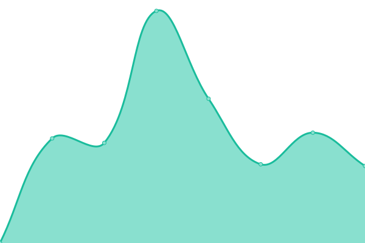

# [📈 Live Status](https://status.pokemon3d.net): <!--live status--> **🟩 All systems operational**

This repository contains the open-source uptime monitor and status page for [Pokémon 3D Legacy](https://pokemon3d.net/), powered by [Upptime](https://github.com/upptime/upptime).

With [Upptime](https://upptime.js.org), you can get your own unlimited and free uptime monitor and status page, powered entirely by a GitHub repository. We use [Issues](https://github.com/P3D-Legacy/status.pokemon3d.net/issues) as incident reports, [Actions](https://github.com/P3D-Legacy/status.pokemon3d.net/actions) as uptime monitors, and [Pages](https://status.pokemon3d.net) for the status page.

<!--start: status pages-->
<!-- This summary is generated by Upptime (https://github.com/upptime/upptime) -->
<!-- Do not edit this manually, your changes will be overwritten -->
<!-- prettier-ignore -->
| URL | Status | History | Response Time | Uptime |
| --- | ------ | ------- | ------------- | ------ |
|  [pokemon3d.net](https://pokemon3d.net) | 🟩 Up | [pokemon3d-net.yml](https://github.com/P3D-Legacy/status.pokemon3d.net/commits/HEAD/history/pokemon3d-net.yml) | 

 1230ms
     
 | 

<a href="https://status.pokemon3d.net/history/pokemon3d-net">99.79%</a>
    

|  [Wiki](https://wiki.pokemon3d.net) | 🟩 Up | [wiki.yml](https://github.com/P3D-Legacy/status.pokemon3d.net/commits/HEAD/history/wiki.yml) | 

 1247ms
     
 | 

<a href="https://status.pokemon3d.net/history/wiki">100.00%</a>
    

|  [Forum](https://forum.pokemon3d.net) | 🟩 Up | [forum.yml](https://github.com/P3D-Legacy/status.pokemon3d.net/commits/HEAD/history/forum.yml) | 

 1162ms
     
 | 

<a href="https://status.pokemon3d.net/history/forum">100.00%</a>
    

|  GameJolt API | 🟩 Up | [game-jolt-api.yml](https://github.com/P3D-Legacy/status.pokemon3d.net/commits/HEAD/history/game-jolt-api.yml) | 

 237ms
     
 | 

<a href="https://status.pokemon3d.net/history/game-jolt-api">100.00%</a>
    

<!--end: status pages-->

[**Visit our status website →**](https://status.pokemon3d.net)

## 📄 License

- Powered by: [Upptime](https://github.com/upptime/upptime)
- Code: [MIT](./LICENSE) © [Pokémon 3D Legacy](https://pokemon3d.net/)
- Data in the `./history` directory: [Open Database License](https://opendatacommons.org/licenses/odbl/1-0/)
